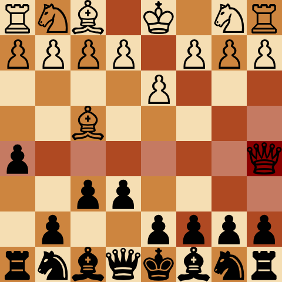

# chess-interface

Chess interface I wrote for Python programming course.



## Running

There is a script to help run this on a Unix machine:

```bash
./scripts/run.sh
```

## Known bugs

* en-passant does not work
* no 50 moves rule
* title of the window should be easy to change...
